# RAG・GraphRAGを活用したエージェント

建設業・公共工事の法務知識に特化した、**ローカル完結型** の Q&A システムです。
共同研究の一部として開発を行いました。

---

> **注意**: 本リポジトリにはコードのみが含まれています。
> RAG用の実務資料（`data/markdown_docs/`）およびFAISSインデックス（`data/vectorstore/`）は機密性の高い共同研究資料のため非公開です。
> cloneしただけでは動作しません。データを別途用意した上でセットアップ手順を実行してください。

---

## 背景と課題

建設工事の法務業務では、**建設業法・民法・労働安全衛生法などの複数の法令** と、**実務的な逐条解説・契約約款** を横断して参照する必要があります。

通常の LLM では次の問題があります。

- 条文間の参照関係（「第 14 条は第 18 条と連動する」など）を把握できない
- 条文番号を指定しても根拠原文を正確に引用できない
- 機密性の高い法務文書を外部 API（OpenAI 等）に送ることへの懸念

これらを解決するため、**知識グラフ（GraphRAG）× ローカル LLM** を組み合わせたシステムを構築を行いました。

---

## 全体アーキテクチャ




---

## 技術スタック選定の理由

### なぜ GraphRAG か（FAISS ベクトル検索だけでなく）

通常の RAG（Retrieval-Augmented Generation）は、テキストの**意味的類似度**でチャンクを検索します。
しかし建設法務では、条文間の**構造的な参照関係**が回答の正確性に直結します。

> 例：「第 18 条（契約書面の交付）」を聞かれたとき、
> 第 19 条・第 19 条の 3 が第 18 条を前提として成立していることを把握していないと、正確な解説ができない。

| 手法 | 得意なこと | 苦手なこと |
|---|---|---|
| FAISS（ベクトル検索） | 意味的に近い文書を拾う | 条文間の参照構造を追う |
| 知識グラフ（GraphRAG） | 条文 A → 条文 B という関係を明示的に保持 | 意味的な曖昧検索 |

両方を組み合わせることで、「意味が近い資料」と「構造的に関連する条文」を同時に LLM へ渡せます。

---

### なぜ Fuseki（SPARQL / RDF）と Neo4j を両方使うのか

単一のグラフ DB にしなかったのは、**二つの DB がそれぞれ異なる役割に特化しているから**です。

#### Fuseki（Apache Jena / RDF トリプルストア）

RDF は知識を **「主語 − 述語 − 目的語」のトリプル** として表現する W3C 標準フォーマットです。
法令知識との相性が高い理由は以下の通りです。

- 条文・章・節・概念を**型付きの関係**として正確に定義できる
  ```
  contract:Article_18 contract:refersTo contract:Article_19 
  contract:Article_18 rdfs:label "契約書面の交付" 
  ```
- `construction_treatise.ttl`（685 トリプル）として知識を一元管理でき、可搬性が高い
- SPARQL により「ある条文を参照しているすべての章節を取得する」といったパターンマッチングが得意

**ただし SPARQL の弱点として**、グラフの多段ホップ（A→B→C のような連鎖参照）や双方向探索は、クエリが複雑になりやすいという点があります。

#### Neo4j（プロパティグラフ DB）

Neo4j の Cypher クエリは、**グラフ構造のナビゲーション**に特化しています。

```cypher
-- 第 18 条から双方向の参照関係と関連概念をまとめて取得
MATCH (a {id: 'Article_18'})
OPTIONAL MATCH (a)-[:REFERS_TO]->(out)
OPTIONAL MATCH (in)-[:REFERS_TO]->(a)
OPTIONAL MATCH (a)-[:RELATES_TO]->(c:Concept)
RETURN collect(DISTINCT out.label), collect(DISTINCT in.label), collect(DISTINCT c.name)
```

このように「参照先・参照元・関連概念」を**1 クエリで双方向に**取得できるのが強みです。
SPARQL で同等の処理を書くと可読性・パフォーマンスともに劣ります。

#### 役割分担まとめ

| | Fuseki | Neo4j |
|---|---|---|
| 役割 | 知識の**モデリング**（スキーマ・型定義） | 知識の**ナビゲーション**（関係の探索） |
| クエリ言語 | SPARQL | Cypher |
| 得意な処理 | 型付きトリプルのパターンマッチング | 双方向グラフ探索・多段ホップ |
| 関係 | ソース・オブ・トゥルース | Fuseki から ETL（`bridge.py`）して生成 |

`bridge.py` が Fuseki の内容を SPARQL で抽出し、Neo4j へ変換・投入する ETL として機能します。

---

### なぜ Ollama（ローカル LLM）か

| 選択肢 | メリット | 採用しなかった理由 |
|---|---|---|
| OpenAI API | 高性能・手軽 | 法務文書の外部送信が問題になる可能性 |
| HuggingFace モデル直接実行 | カスタマイズ性高い | 推論サーバーの実装コストが高い |
| **Ollama** | **ローカル完結・API が Ollama に統一・モデル切替が容易** | ― |

法務文書の機密性を担保するためのローカル実行という要件に加え、
`OLLAMA_BASE_URL` を変数化することで将来の GPU サーバー移行（WSL2 + NVIDIA）にも対応できる設計にしています。

---

### なぜ LangGraph か

LangGraph は **エージェントの処理をグラフ（DAG）として定義** するフレームワークです。

このシステムは「質問 → 法令特定 → 知識グラフ検索 → 法令原文取得 → RAG → 回答生成」という
**複数ステップの推論パイプライン**を持ちます。LangChain の単純なチェーンではなく LangGraph を選んだ理由は以下の通りです。

1. **状態管理**：`AgentState` という型付き辞書で各ノード間のデータ（`target_law`, `graph_data` 等）を明示的に受け渡せる
2. **ノードの責務分離**：各処理（SPARQL 検索・Neo4j 検索・法令取得・RAG）が独立したノードになるため、デバッグ・差し替えがしやすい
3. **ストリーミング対応**：`app.stream()` でノードの完了ごとに SSE でフロントへ進捗を返せる（"知識グラフ検索中..." のようなリアルタイム表示）
4. **拡張性**：条件分岐による動的ルーティング（質問の種類によって Neo4j をスキップするなど）を後から追加しやすい

---

## システム設計の理解まとめ

### DBの役割分担

| DB | 何が入っているか | 何のために使うか |
|---|---|---|
| FAISS | 現場の報告書・逐条解説・契約約款のテキストチャンク | 意味的に近い実務資料を検索する |
| Fuseki | 条文間の refersTo・章節構造（RDFトリプル） | 条文と条文・章の一方向の関係性をSPARQLで検索する |
| Neo4j | Fusekiと同じ内容をグラフ化したもの | 双方向参照・概念ノードへの関係性をCypherで検索する |
| e-Gov API | （DBではない） | 条文の原文をリアルタイムに取得する |

---

### FusekiとNeo4jを両方使う理由

**Fuseki** はある条文と他の条文・章との一方向の関係性は認識できるが、逆方向（どの条文から参照されているか）までは効率的に取れない。

**Neo4j** はその限界を補い：
- 双方向の参照関係（出る・入る両方向）
- 概念ノード（損害・工期・不可抗力など）に紐づく関連条文の網羅

をCypherという専用クエリ言語で一度に取得できる。

概念ノードはハブとして機能し、「損害」というキーワードを含む条文が全て集約されるため、条文番号を指定しなくても概念を起点に横断検索が可能になる。

---

### 回答生成への影響度（現状）

現状はRAGとe-Govが回答の核を担っており、GraphDB（Fuseki・Neo4j）は関係性を示す補足情報に留まっている。

```
FAISS    → 実務資料のテキストを直接プロンプトに渡す → 回答に直接影響
e-Gov    → 条文原文をテキストとして渡す           → 回答に直接影響
Fuseki   → 「関連章節: 第18条」程度の情報          → 影響は限定的
Neo4j    → 参照関係・概念名のリスト               → 影響は限定的
```

---

## ディレクトリ構成

```
Civil_AI_Project/
├── .env                      # 環境変数（Mac / WSL2 切替ポイント）
├── .gitignore
├── docker-compose.yml        # Fuseki / Neo4j / civil-ai-agent
├── bridge.py                 # Fuseki → Neo4j ETL（初回のみ実行）
├── construction_treatise.ttl # RDF 知識グラフ（685 トリプル）
│
├── app/                      # Docker コンテナのアプリ本体
│   ├── Dockerfile
│   ├── requirements.txt
│   ├── api_server.py         # FastAPI エントリポイント
│   ├── main_agent.py         # LangGraph エージェント定義
│   ├── ingest.py             # FAISS インデックス生成
│   ├── convert_pdf.py        # PDF → Markdown 変換
│   └── md_to_fuseki.py       # Markdown → RDF 変換（Fuseki 投入用 .ttl を生成）
│
├── CLI_test/                 # CLI テスト
│   ├── ask.py
│   ├── prompt/question.txt   # 質問を書いて実行
│   └── output/               # 回答ファイル出力先
│
├── frontend/                 # Next.js チャット UI
│   ├── app/page.tsx          # メインページ（ダークテーマ）
│   └── .env.local            # NEXT_PUBLIC_API_URL=http://localhost:8080
│
├── data/
│   ├── markdown_docs/        # 逐条解説 Markdown（39 ファイル）
│   ├── vectorstore/          # FAISS インデックス（生成済み）
│   └── 共同研究/       　　　　 # 元資料
│
└── storage/                  # Docker ボリューム永続化先
    ├── fuseki_data/
    ├── neo4j_data/
    └── ollama/
```

---

## セットアップ手順

### 前提条件

| ソフトウェア | バージョン目安 | 備考 |
|---|---|---|
| Docker Desktop | 4.x 以上 | Apple Silicon 対応 |
| Ollama | 最新 | Mac ホストで実行 |
| Node.js | 18 以上 | フロントエンド用 |
| uv | 最新 | ホスト実行スクリプト用（bridge.py / CLI テスト） |

### 1. uv 環境のセットアップ

```bash
uv sync
```

### 2. モデルのダウンロード（Ollama）

```bash
ollama pull qwen2.5:7b
ollama pull nomic-embed-text
```

### 3. 環境変数の設定

`.env.example` をコピーして `.env` を作成し、パスワード等を設定します。

```bash
cp .env.example .env
```

`.env` を開き、以下の項目を環境に合わせて設定してください。

| 項目 | 説明 |
|---|---|
| `FUSEKI_ADMIN_PASSWORD` | Fuseki 管理画面のパスワード（任意の文字列） |
| `NEO4J_PASSWORD` | Neo4j のパスワード（任意の文字列） |
| `OLLAMA_BASE_URL` | Mac環境は `http://host.docker.internal:11434`、WSL2環境は `http://ollama:11434` |

### 4. Docker コンテナ起動

```bash
docker compose up -d --build
```

起動後のサービス:

| サービス | URL |
|---|---|
| FastAPI バックエンド | http://localhost:8080 |
| Fuseki 管理 UI | http://localhost:3030 |
| Neo4j Browser | http://localhost:7474 |

### 5. データ初期ロード（初回のみ）

**① Fuseki へ RDF グラフをアップロード**

`.env` の `FUSEKI_ADMIN_PASSWORD` を確認した上で実行してください。

```bash
# データセット "ConstructionLaw" を作成
curl -X POST http://localhost:3030/$/datasets \
  -H "Content-Type: application/x-www-form-urlencoded" \
  --data "dbName=ConstructionLaw&dbType=tdb2" \
  -u admin:${FUSEKI_ADMIN_PASSWORD}

# TTL ファイルをアップロード
curl -X POST "http://localhost:3030/ConstructionLaw/data" \
  -H "Content-Type: text/turtle" \
  --data-binary @construction_treatise.ttl \
  -u admin:${FUSEKI_ADMIN_PASSWORD}
```

**② Fuseki → Neo4j へグラフを転送（ETL）**

```bash
uv run bridge.py
```

**③ FAISS ベクトルインデックス生成**

```bash
docker compose exec civil-ai-agent python /app/ingest.py
```

### 6. 動作確認

**API ヘルスチェック**

```bash
curl http://localhost:8080/health
```

**CLI テスト**

```bash
echo "第14条において受注者の義務を教えて" > CLI_test/prompt/question.txt
uv run CLI_test/ask.py
```

**Web UI**

```bash
cd frontend
npm install
npm run dev
# → http://localhost:3000
```

---

## 動作例

```
質問: 第18条において受注者はどのような義務を負うか

🔍 質問を分析中...
📊 知識グラフ(Fuseki)検索中: 第18条 に関連する項目...
🔗 Neo4j検索中: Article_18 の関係を取得...
🌐 e-Gov API検索: 建設業法 第18条
📚 RAG資料検索中...
🧠 回答構成中...

【回答】
建設業法第18条は、建設工事の請負契約の原則を定めた規定です。
受注者（請負人）は発注者（注文者）と対等な立場において公正な契約を締結し、
信義に従って誠実に履行する義務を負います。

・この条文が参照: 第19条（契約書面の交付）, 第19条の3（不当に低い請負代金の禁止）
・関連概念: 請負契約, 信義則, 対等原則

---
### 📚 参照ソース
【Fuseki知識グラフ参照】
【Neo4j グラフ参照】
【e-Gov API参照】建設業法 第18条
【RAG参照資料】
・markdown_docs/article_18.md
```

---

## コンテナの操作

```bash
# 起動
docker compose up -d

# 停止
docker compose stop

# ログ確認
docker compose logs -f civil-ai-agent

# 再ビルド（requirements.txt 変更後）
docker compose up -d --build civil-ai-agent
```

---

## WSL2 + NVIDIA GPU への移行

1. `.env` の `OLLAMA_BASE_URL` を切り替え:
   ```
   OLLAMA_BASE_URL=http://ollama:11434
   ```
2. `docker-compose.yml` の `ollama:` セクションのコメントを解除
3. `civil-ai-agent` の `extra_hosts` を削除
4. `docker compose up -d --build`

## 今後の改善・発展

### 関連条文の原文取得（精度向上）

現状、e-Gov API から取得するのは質問に対して最も核となる**1条文のみ**です。

しかし法律の解釈は「この条文単体」ではなく「関連条文を組み合わせて初めて意味が確定する」ことが多くあります。
FusekiとNeo4jはすでに条文間の参照関係を保持しているため、取得した関連条文番号をもとにe-Gov APIへ複数回問い合わせることで、より本質的な回答が生成できます。

```
現状:  第14条の原文 + 「第18条・第19条と関連している」という関係情報のみ
理想:  第14条 + 第18条 + 第19条 の原文を横断して引用した回答生成
```

`sparql_node` / `neo4j_node` で得た関連条文番号を `fetch_law_node` に渡してループ取得し、さらに概念ノードを起点とした横断検索まで実装できれば真のGraphRAGが実現できる。

---

## 使用技術

| カテゴリ | 技術 |
|---|---|
| LLM | Ollama + qwen2.5:7b |
| 埋め込みモデル | nomic-embed-text |
| エージェントフレームワーク | LangGraph + LangChain |
| 知識グラフ（RDF） | Apache Fuseki / SPARQL |
| プロパティグラフ | Neo4j 5 |
| ベクトル検索 | FAISS |
| 法令原文取得 | e-Gov 法令 API |
| バックエンド | FastAPI + uvicorn |
| フロントエンド | Next.js 14 App Router + Tailwind CSS |
| インフラ | Docker Compose |
